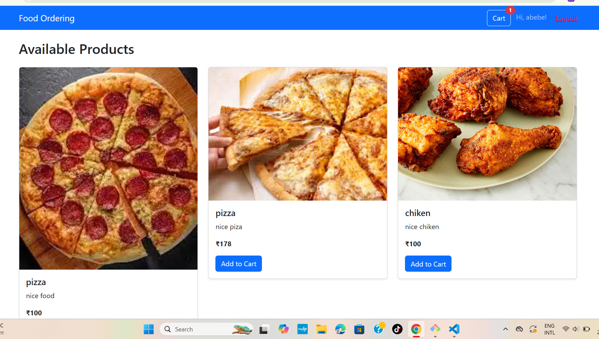
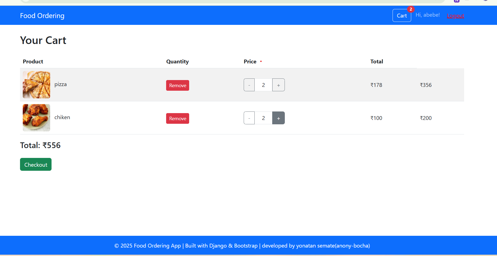
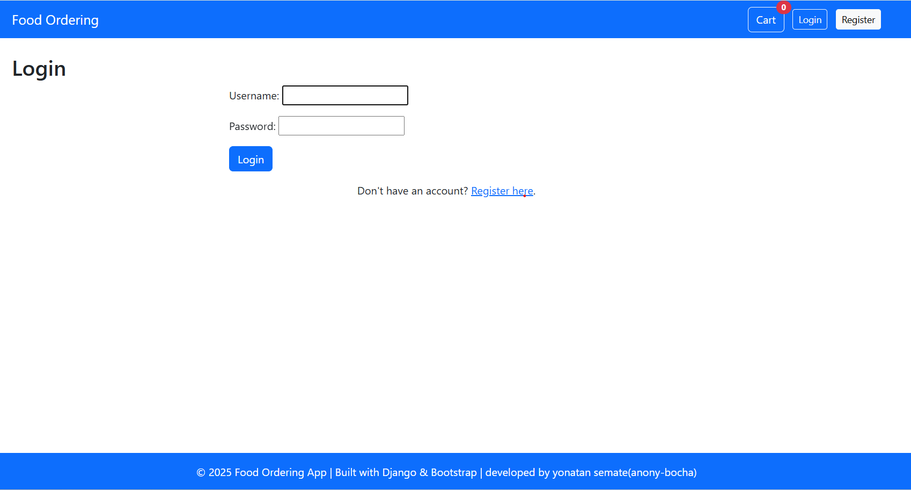
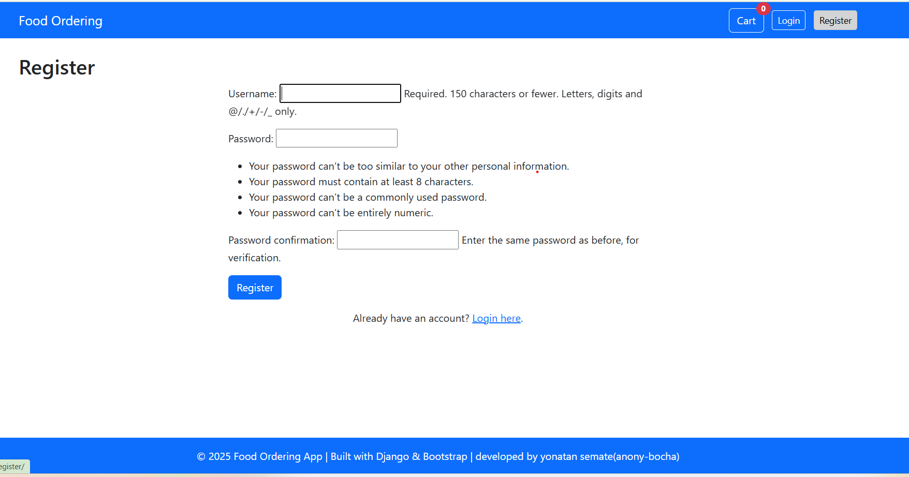
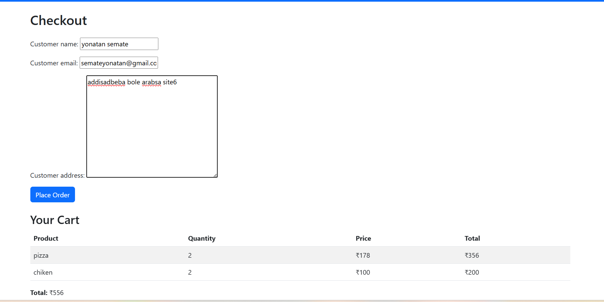
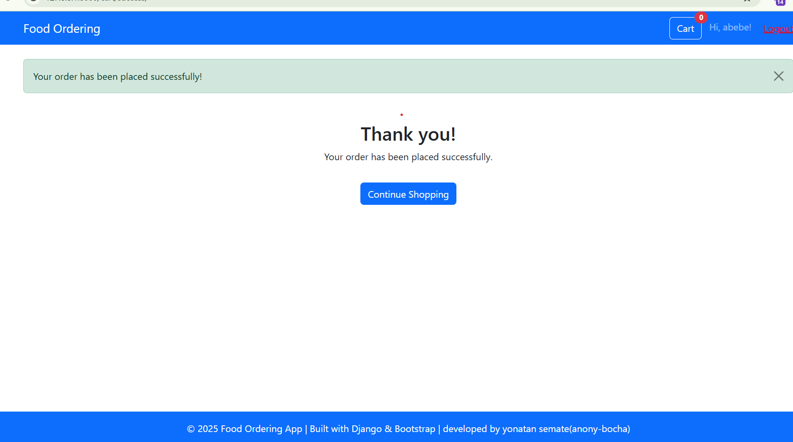

# Django Food Ordering Application



A modern, responsive web application for ordering food online, built with Django and Bootstrap 5. This app provides a seamless user experience for browsing products, managing a shopping cart, and placing orders.

---
[](https://foodordering-kgwb.onrender.com)

## 🚀 Features

- **User Authentication:** Registration, login, and logout functionality for secure access.  
- **Product Catalog:** Display food products with images, descriptions, and prices.  
- **Shopping Cart:** Add, remove, and update quantities of products in the cart.  
- **Checkout Process:** Collect customer details and confirm orders.  
- **Order Management:** Store order details including items, quantities, and prices.  
- **Responsive Design:** Fully responsive UI using Bootstrap 5 for mobile and desktop.  
- **Session-Based Cart:** Cart persists across user sessions without login.  
- **Real-Time Cart Badge:** Displays current number of items in the cart in navbar.

---

## 📸 Screenshots

| Product List                    | Cart Page                       |
|--------------------------------|--------------------------------|
|  |  |

| login                   | register                       |
|--------------------------------|--------------------------------|
|  |  |

| Checkout Page                  | Order Success                   |
|-------------------------------|--------------------------------|
|          |  |

---

## 🛠️ Installation

### Prerequisites

- Python 3.8+  
- Git  
- Virtual Environment tool (venv)
## 🗂️ Project Structure

- `products/` - Handles product listing and management
- `cart/` - Manages cart operations, checkout, and orders
- `templates/` - HTML templates
- `static/` - CSS, JS, and images
- `media/` - Uploaded product images
## 🚀 Usage

- Visit `http://127.0.0.1:8000/` in your browser.
- Register a new account or log in with your superuser account.
- Browse products, add to cart, and proceed to checkout.
- View your orders under "My Orders" after logging in.
## 📝 License

This project is licensed under the MIT License.

## 📧 Contact

For any inquiries or freelance opportunities, please contact:

- Email: [yse.com]
- GitHub: [anony-bocha](https://github.com/anony-bocha)

### Setup Steps

1. **Clone the repository**

   ```bash
   git clone https://github.com/anony-bocha/foodordering.git
   cd foodordering
# Create and activate a virtual environment
python -m venv env
source env/bin/activate        # On Windows: env\Scripts\activate

# Install dependencies
pip install -r requirements.txt

# Apply migrations
python manage.py migrate

# Create a superuser to access the admin
python manage.py createsuperuser

# Run the server
python manage.py runserver
